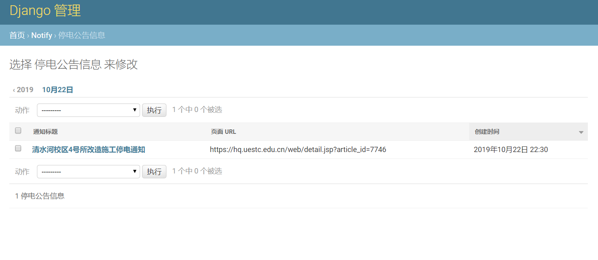
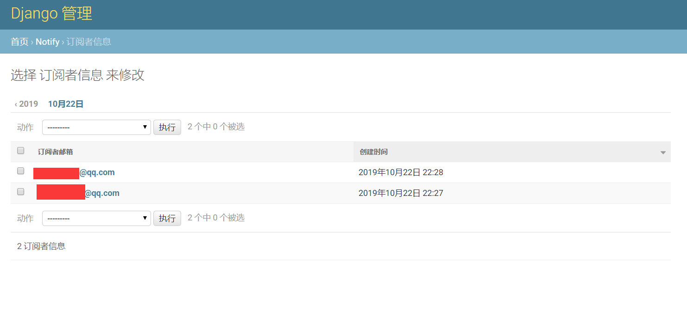
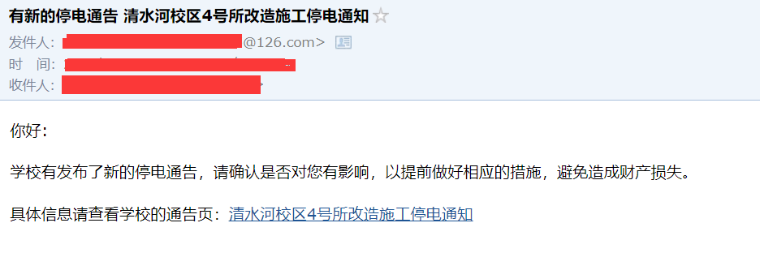

# 停电检测的服务

## 此项目的功能

此项目用来检测学校的**停断电公告**信息，并及时将新的停断电公告信息**推送给订阅者的邮箱**，从而让订阅者提前做好服务器断电的准备工作，避免服务器等设备因意外断电而造成数据丢失。

## 为何会有这个项目

1. 曾因为没有及时获知学校的停电通告，没有提前关闭服务器，服务器在运行过程中被强行断电，造成服务器上的**数据丢失**。事后的数据恢复工作十分繁杂，且未备份的数据没能完全找回。简而言之，就是因为服务器运行中意外断电造成过数据丢失。
2. 在断电前几天，学校就会在后勤保障部门的网站上**提前告知**停电事件
3. 本人会忘记关注学校的停电通知，因此想让程序在有新的停电事件公布时**自动推送本人邮箱**

## 所用到的技术

- Django （Python Web 框架）
- django-crontab （Django 定时任务）
- selenium ( 自动测试工具，此处用来爬取数据 )

## 实现

1. Django 数据库中提前保存订阅者邮箱信息
2. 利用 django-crontab 实现定时爬虫任务， selenium 每天爬取一次学校**最新**发布的公告信息
3. 如果爬取到新的公告信息，将其放到后台数据库中，用于**去重**（同一通告信息只通知一次），同时利用
   Django 提供的 SMTP 邮件功能发送邮件给订阅者

## 环境依赖

- Linux (windows 下 django-crontab 运行有问题)
- Python 3
- chromium-chromedriver (安装: `sudo apt-get install
  chromium-chromedriver`)
- nginx （部署用，也可直接采用 runserver 运行服务）
- python 包: requirement.txt 文件 (安装: `pip install -r requirement.txt`)

## 部署

1. 部署前先在 power_outage_notify/settings.py 中编辑自己用于通知的邮箱

        # TODO: 请设置自己用于发邮件的邮箱, 设置自己的邮箱及授权码
        # 自己的邮箱
        EMAIL_HOST_USER = 'xxx@126.com'
        # 自己的邮箱授权码，非密码
        EMAIL_HOST_PASSWORD = 'xxxx'

2. 添加爬虫检测的定时服务: python manage.py crontab add
3. 查看定时服务: python manage.py crontab show
4. python manage.py makemigrations
5. python manage.py migrate (数据库迁移)
6. python manage.py createsuperuser （创建后台管理员账号）
7. python manage.py collectstatic （生成静态文件）
8. python manage.py runserver
   （运行服务，此方式仅在单机测试环境使用，生产环境部署请使用 Nginx + wsgi
   方式运行）
9. 进入 admin 后台，添加订阅者的邮箱 (后台管理地址，浏览器中访问: `http://服务器地址:服务监听的端口/admin/` )
   
## 运行效果

- 学校发布通知信息的网站

- 后端爬取到的停电信息

- 订阅者信息

- 邮箱通知效果

